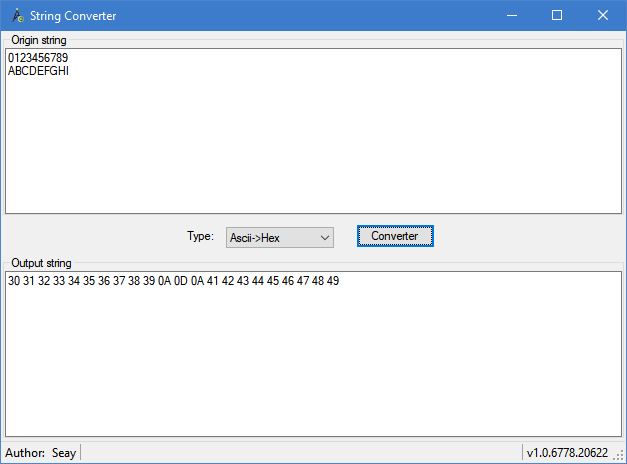

# StringConverter

Ascii <=> Hex String

Download from [here](dist/StringConverter.exe)



# Hex String => Ascii

input:
```
30 31 32 33 34 35 36 37 38 39 0D 0A 41 42 43 44 45 46 47 48 49
```

output:
```
0123456789
ABCDEFGHI
```

# Ascii => Hex String

input:
```
0123456789
ABCDEFGHI
```

output:
```
30 31 32 33 34 35 36 37 38 39 0D 0A 41 42 43 44 45 46 47 48 49
```